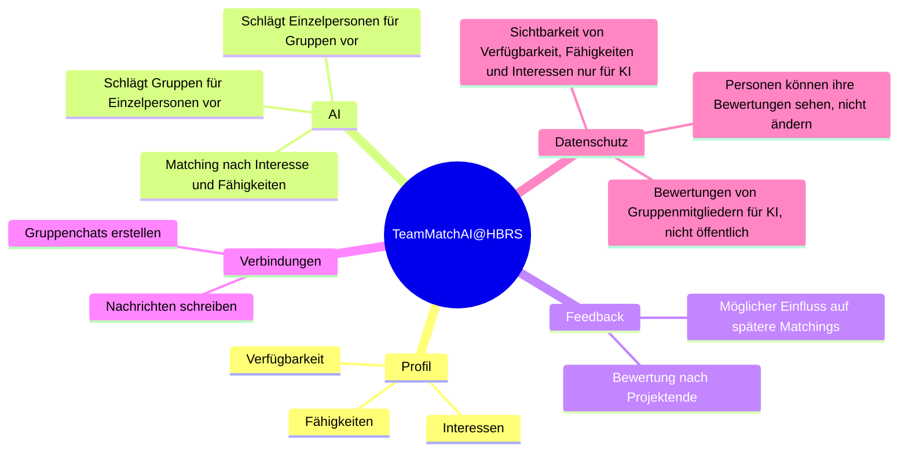

```mermaid:
mindmap
    root((TeamMatchAI@HBRS))
        Profil
            Interessen
            Fähigkeiten
            Verfügbarkeit
        AI 
            Matching nach Interesse und Fähigkeiten
            Schlägt Einzelpersonen für Gruppen vor
            Schlägt Gruppen für Einzelpersonen vor
        Feedback
            Bewertung nach Projektende
            Möglicher Einfluss auf spätere Matchings
        Verbindungen
            Nachrichten schreiben
            Gruppenchats erstellen
        Datenschutz
            Bewertungen von Gruppenmitgliedern für KI, nicht öffentlich
            Personen können ihre Bewertungen sehen, nicht ändern
            Sichtbarkeit von Verfügbarkeit, Fähigkeiten und Interessen nur für KI
    
```